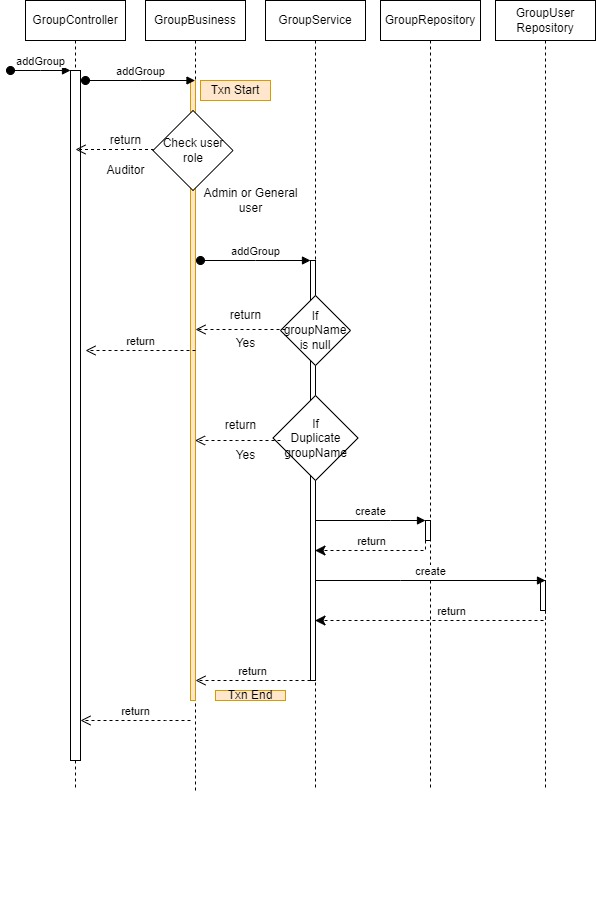

## File Manager Rest API Design

1)	**Register User /fileManagement/user/registerUser**
   
Register User is a POST API accepting details of the user to be created including Name of the user, email id of the user, and password.
Detailed parameters & responses for the REST API can be found on Swagger.  
 
●	 **Preconditions:**

Name of the User- should not be null or empty. Size must be less than 64 chars. Also it shall not contain any special characters
Email id of user - Should not be null or empty
Password - Should not be null or empty. Size should be a minimum of 8 characters.

●	 **Postconditions:**

If all the preconditions are met properly, a new user will be registered in the system but it is not validated yet.
UserId:  This parameter contains UserId. 
OtpValidityTime: This parameter will contain valid time within which OTP is to be entered.

●	**Exceptions**

Following would be the exception conditions

| Exception Condition | Error Message |
|---|---|
| If transaction getting failed to start | Unable to Start Transaction.. |
| If a transaction fails to commit. | Error while Committing transaction .. |

-	Sequence Flow logic and diagram

 
■	Operations performed at each layer of the framework by this API are as below:
1.	**Controller**
   
	In this REST API, Following Object is accepted - {name,email,password }

2.	**Business**
   
	Following Object is accepted - {name,email,password }

	●	Start transaction.

	●	Call registerUser method from UserService and if no exception occurs submit transaction.

4.	**Service**
   
	Following Object is accepted - {name,email,password }

	●	Check email duplication from valid users only, if duplicate email found then give exception as email address already present.

	●	To create an encrypted password call ScalarCrypter.encrypt method.

	●	If the email is already present but not validated then update the same userId.

	●	Build a user object.

	●	Generate OTP for registration.

	●	Send OTP through email on given emailId.

	●	UserId and OtpVAlidationTime sent in response.

■	**2) Validate User /fileManagement/user/validateUser**

Validate User is POST API accepting details of the user otp to be validated including Id of the user, otp..
Detailed parameters & responses for the REST API can be found on Swagger.   
●	**Preconditions:**

UserId- should not be null.
otp - Should not be null.
●	**Postconditions:**

If all the preconditions are met properly, a new user will be validated in the system.

UserId: This parameter contains UserId. 
UserName: This parameter contains a name of the user. 
Email: This parameter contains the email id of the user. 
itemId: This parameter contains root item id for the user. 
Token: This parameter contains token for user
●	**Exceptions**

Following would be the exception conditions

| Exception | Error Message |
|---|---|
| If transaction getting failed to start. | Unable to Start Transaction.. |
| If a transaction fails to commit. | Error while Committing transaction .. |
| If wrong otp entered | Please enter correct OTP |
| If record not present in system | Data not found |
| If otp validity expire | OTP validity expired |
| If folder name is empty | Folder name should not be empty |
| If parent item is not folder | Parent item is not a folder type |
| If user is not owner or editor | User don’t have access |
| If folder name already present in the system | Duplicate folder name |

○	Operations performed at each layer of the framework by this API are as below:

1.	**Controller**
   
	In this REST API, Following Object is accepted - {userId, otp }

2.	**Business**
   
	Following Object is accepted - {userId, otp }

	●	Start transaction.

	●	Call validateOtp method from OtpService.

	●	If no exception is thrown, delete the otp record from otp table.

	●	Set validate_user true and update user record.

	●	To create a root folder for users, call addFolder method from FolderService.

	●	If no exception comes, generate a token for the user.

	●	To generate a token call generate method from tokenService.

	●	If no exception comes, build a TokenItemDetails object for response.

4.	**Service**
   
		- OtpService:
  	
			Following params are accepted - userId, otp, transaction
			Match opt with system record and also check for time validity.
  	
		- FolderService:
  	
		Following params are accepted - itemId,      itemName,userId,aclMaxId,itemMaxId,transaction.
		●	Get the Item object for the parentID (itemID)
		●	Get ACL for the parent Item
		●	Check if the parent Item is root (System Root), if yes
		●	Create Folder with ACL of UserId as owner & editor
		●	Update  
		●	If parent is not System Root,
		●	Get ACL of Parent
		●	If user is owner of parent folder, then copy ACL of the parent
		●	If user is Editor of parent folder, then make user owner of new folder and copy ACL of parent by changing owner to editor
		●	If user is not owner/editor return the method with Exception “No appropriate Access rights”
		●	Create new ACL and save to ACLRepository
		●	Create new PathCollection and save to PathCollectionRespository
		●	If auditStatus=1, or parent Item auditStatus = 1 then 
		●	Create contract for Item creation and execute contract on Scalar DL
		●	Transaction marked in RED in the diagram
		●	Create new Item and save to ItemRepository

		- TokenService:
  	
		Following params are accepted - userId, tokenAttributes,transaction
		Generate a token and add it to the token table.

■	**3) Login User /fileManagement/user/login**

Logs in user using POST method
-	**Preconditions:**
	
A user should be Registered Successfully In the System.
Provide the Username(i.e email) and password.
userName- should not be null or empty.
password - Should not be null or empty.

-	**Postconditions:**
  
If all the preconditions met properly, you should be able to get loginOutput response
Which consist of
userId:  This parameter contains UserId. 
userName: This parameter contains the name of the user.
email: This parameter contains email id for user.
token: This parameter contains a token for the user..
itemId: This parameter contains the root item id for the user.

●	**Exceptions**

Following would be the exception conditions

| Exception | Error Message |
|---|---|
| If transaction getting failed to start | Unable to Start Transaction.. |
| If a transaction fails to commit. | Error while Committing transaction .. |
| If user root item not present in the system | USER ROOT ITEM_NOT FOUND ! |
| If userName and password are null or empty | userName cannot be null or empty/password cannot be null or empty |
| If userName(i.e email) Is Not Registered | USER_NOT_FOUND |
| If Password is Invalid | Password does not match!.. |

-	Sequence Flow logic and diagram
  
  
 
-	Operations performed at each layer of the framework by this API are as below:
  
1.	**UserController.login()**
   
	●	In this REST API, Following Object is accepted - {userName,password }

2.	**UserBusiness.loginUser()**
   
	●	Following Object is accepted - {userName,password }

	●	Start Transaction 

	●	Call userService.validateEmailPass to validate User
	
 	●	If User validation is successful,then call tokenService.updateToken
	
 	●	It will generate a new token and will pass on to the tokenRepository.update method to save new token in the database.
	
 	●	Then start to build the response Object with the following field data in it.(userId,userName,email,itemId,token,role) .
	
 	●	Commit Transaction

3.	**userService.validateEmailPass**
   
	●	 Validate the User with userName, password.

■	**4) Get User List /fileManagement/user/getUserList**

getUserList is a GET API for getting all users' lists from the system. Detailed parameters & responses for the REST API can be found on Swagger. 

-	**Preconditions:**
  
A valid Jauth (token) is provided.

-	**Postconditions**
  
Get all system users list except system root.
userId:  This parameter contains UserId. 
userName: This parameter contains the name of the user.
email: This parameter contains email id for user.
role: This parameter contains the system role of the user.

-	**Exceptions**
-	
Following would be the exception conditions

| Exception | Error Message |
|---|---|
| If transaction getting failed to start | Unable to Start Transaction.. |
| If a transaction fails to commit. | Error while Committing transaction .. |

○	**Operations performed at each layer of the framework by this API are as below:**

1.	**UserController : getUserList()**
   
		In this REST API, Following params are accepted - Jauth
The Authorization of the request is done by Jauth @ApiOperation
The JauthAuthenticationFilter shall extract the token and validate the same
	
2.	**Business : getUserList()**
   
	In this REST API, Following params are accepted - Jauth

3.	**Service : getUserList()**

	●	Get userId from token.
	
 	●	Get all users list from db.

	●	If the logged in user is a general user then admin, auditor and logged in user are removed from the list.
	
 	●	If the logged in user is admin then only logged in user name is removed from list.

	●	Send userList including fields userId, userName, email and role.

■	**5) Search User List /fileManagement/user/searchUserList**

searchUserList is a GET API for getting all users' lists from the system from search string. Detailed parameters & responses for the REST API can be found on Swagger. 

●	**Preconditions:**

Provide the valid jauth(i.e token)
userName : This parameter contains a search string,  which can be empty.

●	**Postconditions:**

Return list of all users starting with the given search string.
userId:  This parameter contains UserId. 
userName: This parameter contains the name of the user.
email: This parameter contains email id for user.
role: This parameter contains the system role of the user.

●	**Exceptions**

Following would be the exception conditions

| Exception | Error Message |
|---|---|
| If transaction getting failed to start | Unable to Start Transaction.. |
| If a transaction fails to commit. | Error while Committing transaction .. |
| If jauth(token) provided is invalid | Invalid Token/Jauth |

○	**Operations performed at each layer of the framework by this API are as below:**

1.	**UserController : searchUserList()**

	In this REST API, Following params are accepted - userName,jauth
The Authorization of the request is done by Jauth @ApiOperation
The JauthAuthenticationFilter shall extract the token and validate the same
	
2.	**Business : searchUser()**

	In this REST API, Following params are accepted - userName,jauth

3.	**Service : searchUser()**

	●	Following params are accepted - userName,jauth,transaction

	●	Get userId from token.

	●	Get all users list from db.

	●	Root user and logged in user removed from list

	●	Filter userList from search string and sent result
	

■	**6) Update user /fileManagement/user/updateUser**

Update User is PUT API accepting Name of the user to be updated.
Detailed parameters & responses for the REST API can be found on Swagger.

-	**Preconditions:**
  
Provide the valid jauth(i.e token)
name: name of the User should not be null or empty. Also it shall not contain any special characters.
-	**Postconditions:**
  
If the above conditions are met then the user’s name is updated.
message: “User profile updated…”

-	**Exceptions**
  
Following would be the exception conditions

| Exception | Error Message |
|---|---|
| If transaction getting failed to start | Unable to Start Transaction.. |
| If a transaction fails to commit. | Error while Committing transaction .. |
| If jauth(token) provided is invalid | Invalid Token/Jauth |

-	Sequence Flow logic and diagram

 
-	**Operations performed at each layer of the framework by this API are as below:**

1.	**UserController : updateUser()**

In this REST API, Following params are accepted - name, jauth
The Authorization of the request is done by jauth @ApiOperation
The JauthAuthenticationFilter shall extract the token and validate the same

2.	**UserBusiness : updateUser()**

		Following params are accepted - name, jauth

3.	**UserService : updateUser()**

	●	Following params are accepted - name, jauth, transaction.

	●	Get userId from token.
	
 	●	Set a new user name and update in the user repository.

■	**7) Delete User /fileManagement/user/deleteUser**

Deletes a user from system 

-	**Preconditions:**

Provide the valid jauth(i.e token) In request header.
userId: Provide the user id to be deleted.

-	**Postconditions:**

Once all preconditions are met then delete the user from the system.
Message: “User deleted…”

-	**Exceptions**
-	
Following would be the exception conditions

|Exception | Error Message |
|---|---|
| If transaction getting failed to start | Unable to Start Transaction.. |
| If a transaction fails to commit. | Error while Committing transaction .. |
| If jauth(token) provided is invalid | Invalid Token/Jauth |

-	Sequence Flow logic and diagram

 
-	**Operations performed at each layer of the framework by this API are as below:**

1.	**UserController : deleteUser()**

	In this REST API, Following params are accepted - user_id, jauth
The Authorization of the request is done by jauth @ApiOperation
The JauthAuthenticationFilter shall extract the token and validate the same

2.	**UserBusiness : deleteUser()**

	Following params are accepted - user_id, jauth

	●	Start transaction

	●	Get userId from token.

	●	Check for admin user 

	●	Get user object from userId.

	●	Set isDeleted as true.
	
 	●	Update UserRepository.

	●	Return message “User deleted…” in response.

	●	Check for general user 
 
		○	Get rootItemCollection obj from userId.

		○	Call deleteFolder from folderService to delete the root folder of the user to be deleted.

	●	Auditor doesn’t have authority to delete users.

	●	Commit transaction.

■	**8) Logout User /fileManagement/user/logout**

Call the api using PUT method without any parameters

-	**Preconditions:**

Provide the valid jauth(i.e token).

-	**Postconditions:**

-	If all the preconditions met properly, the jauth (token) is invalidated and the user has to re login.
Message: “Logout Successfully”

-	**Exceptions**

Following would be the exception conditions

| Exception | Error Message |
|---|---|
| If transaction getting failed to start | Unable to Start Transaction.. |
| If a transaction fails to commit. | Error while Committing transaction .. |
| If jauth(token) provided is invalid |	Invalid Token/Jauth |

-	Sequence Flow logic and diagram

 
-	**Operations performed at each layer of the framework by this API are as below:**

1.	**UserController.logout()**

	●	In this REST API,Get the jauth in header and pass on to the business layer.

2.	**userBusiness.logout()**

	●	Following jauth header is accepted 

	●	Start Transaction 

	●	Then call tokenService.getTokenByJauth this method will give it as Token Object.

	●	And  call the userService.logout method 

	●	Then update the token object with placing the tokenString  as “null” and createdOn Date as ‘0’

	●	Then Commit the transaction

	●	And it will return json Object including the message “Logout Successfully”.

3.	**tokenService.getTokenBy**

	○	method will give a Token Object.

■	**9) Register User By Admin fileManagement/user/registerUserByAdmin**

Call the api using POST method

-	**Preconditions:**

Name of the User- should not be null or empty. Size must be less than 64 chars. Also it shall not contain any special characters
Email id of user - Should not be null or empty
Password - Should not be null or empty. Size should be a minimum of 8 characters.
role- Should contain system role.

-	**Postconditions:**

If all the preconditions met properly, the new user with the given role is registered in the system.
userId:  This parameter contains UserId. 
userName: This parameter contains the name of the user.
email: This parameter contains email id for user.
role: This parameter contains the system role of the user
token: This parameter contains a token for the user..
itemId: This parameter contains the root item id for the user.

-	**Exceptions**

Following would be the exception conditions

| Exception | Error Message |
|---|---|
| If transaction getting failed to start | Unable to Start Transaction.. |
| If a transaction fails to commit. | Error while Committing transaction .. |

-	Sequence Flow logic and diagram

 
-	**Operations performed at each layer of the framework by this API are as below:**

1.	**UserController : registerUserByAdmin()**

In this REST API, Following Object is accepted - {name,email,password,role }

2.	**UserBusiness : registerUserByAdmin()**

	Following Object is accepted - {name,email,password,role }
	Start transaction.

	●	Check email duplication from valid users only, if duplicate email found then give exception as email address already present.

	●	To create an encrypted password call ScalarCrypter.encrypt method.

	●	If the email is already present but not validated then update the same userId.

	●	Build a user object.
	
 	●	If the user role is general user then call folderService.addFolder() to create a root item for a new user and also create an entry in rootItemCollection.

	●	Else only add entries in rootItemCollection.

	●	Generate a token by calling tokenService.generate().

	●	Commit transaction.

	●	Return tokenItemDetailsObject with fields userId, userName, email, itemId, token, role.	
	
3.	**FolderService : addFolder()**

	Called to add a new root folder for newly created user.

4.	**TokenService : generate()**

	Called to generate a new token for the user.
	

■	**10) OTP for Reset Password /fileManagement/user/sendResetPasswordOTP**

Call the api using GET method

-	**Preconditions:**

email: This parameter contains the email id of the user.

-	**Postconditions:**

-	If all the preconditions met properly, an OTP is sent to existing users' email.
UserId:  This parameter contains UserId. 
OtpValidityTime: This parameter will contain valid time within which OTP is to be entered.

-	**Exceptions**

Following would be the exception conditions

| Exception | Error Message |
|---|---|
| If transaction getting failed to start | Unable to Start Transaction.. |
| If a transaction fails to commit. | Error while Committing transaction .. |
| If failed to send email | Unable to send email.. |
| If emailId already present in system | Email address already present |

○	**Operations performed at each layer of the framework by this API are as below:**

1.	**UserController : sendResetPasswordOTP**

In this REST API, Following parameter is accepted -email
2.	**UserBusiness :**

	Following parameter is accepted - email

	●	Start transaction.

	●	Call sendResetPasswordOTP method from UserService and if no exception occurs submit transaction.

3.	**UserService**

	●	Check if the given email is valid or not.
	
 	●	Generate OTP by calling GenericUtility.generateOtp().

	●	Send otp on email to reset password.

	●	Save otp details in otp repository.

	●	Send userId and otp validity time in response.

■	**11) Update Password  /fileManagement/user/updatePassword**

Call the api using POST method

-	**Preconditions:**

newpassword: It should not be null or empty. It should contain a minimum of 8 characters. 
userId: It should not be null or empty.

-	**Postconditions:**

If all the preconditions met properly, the password is updated for the userid.
Message: “Password Updated successfully..”

-	**Exceptions**

Following would be the exception conditions

| Exception | Error Message |
|---|---|
| If transaction getting failed to start | Unable to Start Transaction.. |
| If a transaction fails to commit. | Error while Committing transaction .. |
| If user not present in the system | User Not Found ! |

-	Sequence Flow logic and diagram

 
-	**Operations performed at each layer of the framework by this API are as below:**

1.	**UserController: updatePassword()**

In this REST API, Following Object is accepted - {userId, newPassword }

2.	**UserBusiness: updatePassword()**

	Following Object is accepted - {userId, newPassword }

	●	Start transaction.

	●	Call updatePasswordDto method from UserService and if no exception occurs submit transaction.

3.	**UserService: updatePasswordDto()**

	Following Object is accepted - {userId, newPassword}

	●	Get user object from userId.

	●	If an object is not found, give NotFoundException.

	●	Set a new password to the user object and update it.

■	**12) Verify OTP  /fileManagement/user/verifyOtp**

Call the api using POST method

-	**Preconditions:**

newpassword: It should not be null or empty. It should contain a minimum of 8 characters. 
userId: It should not be null or empty.

-	**Postconditions:**

-	If all the preconditions met properly, the password is updated for the user id..
Message: “OTP validated”

-	**Exceptions**

Following would be the exception conditions

| Exception | Error Message |
|---|---|
| If transaction getting failed to start | Unable to Start Transaction.. |
| If a transaction fails to commit. | Error while Committing transaction .. |

-	**Operations performed at each layer of the framework by this API are as below:**

1.	**UserController: verifyOtp()**

	In this REST API, Following Object is accepted - {userId, otp}

2.	**UserBusiness: verifyOtp()**

	Following Object is accepted - {userId, otp}

	●	Start transaction.

	●	Validate otp by calling otpService.validateOtp().

	●	If otp validated successfully then delete otp from otp repository.

	●	Commit transaction.

3.	**OtpService: validateOtp()**

	Following params are  accepted - userId, otp, transaction

	●	Get otp object by userId.

	●	Check if the entered otp is correct or not.

	●	Check otp validity time if it is greater than current time then send a response that OTP Validated otherwise sent OTP validity expired.

■	**File Controller**

■	**Overview**
File Controller is REST API Controller for file related operations on Scalar FM.   

■	**REST API**

Following are the REST API’s for the file related operations. The API documentation and execution approach is documented on Swagger.

■	**13) Add a file  /fileManagement/file/addFile**

Adds a file using the POST method. 

-	**Preconditions:**

The Authorization of the request is done by jauth.
The JauthAuthenticationFilter shall extract the token and validate the same
parentItemId- should not be 0 and 1(i.e System Root). 
multipartFile - provide file to be uploaded.
Jauth(Token) - provide valid userToken 

-	**Postconditions:**

If all the preconditions met properly, a new file will be created in the parent folder with access rights as follows
	File will get upload On AWS-S3
Owner: User creating file
Parent Folder owner - will have Editor access rights
All the other user access for the parent folder shall retain.

-	**Exceptions**

Following would be the exception conditions

| Exception | Error Message |
|---|---|
| If multipart file not converted into File type | Exception while converting the multipart file to file.. |
| If transaction getting failed to start | Unable to Start Transaction.. |
| If a transaction fails to commit. | Error while Committing transaction .. |
| If user not present in the system | User Not Found ! |
| If parent item id not present in the system |	Parent Item Not Found ! |
| If parent item type is ‘file’ | Can’t create File in Item Type File .. |
| If jauth(token) provided is invalid |	Invalid Token/Jauth |
| If file greater than 10MB | File greater than 10MB |

-	Sequence Flow logic and diagram

 
-	Operations performed at each layer of the framework by this API are as below:

1.	**FileController ; addFile()**

	In this REST API, Following params are accepted - multipartFile, parentItemId,  jauth

	●	Build fileMetaDataObject for file metadata.

2.	**FileBusiness : addFile()**

	Following params are accepted - multipartFile, fileMetadataObject, jauth

	●	Convert multipart file to file.

	●	Start transaction.

	●	Generate UUID for item and acl.

	●	Call addFile() from FileService.

	●	Commit transaction

	●	If file uploaded successfully in scalarDB then continue
	
 		-	Get item object from above response.

		-	If item audit status is 3 then call addAsset() from assetService.

		-	Return message “File uploaded successfully” in response.

3.	**FileService : addFile()**

	Following params are accepted - file, fileMetaDataObject, maxForItem, maxForAcl, jauth, transaction

	●	Get userId from token.

	●	Check for parent item id, if it is 1 then user don’t have access to add file.

	●	Check for duplicate file names.

	●	Check for item type, if it is file can’t create file inside file.

	●	If a logged in user is an auditor then doesn’t have access to add files.

	●	Check user access for the parent folder.

	●	If the logged in user is admin then check for admin don’t have access to add file in any other user’s folder.

	●	Call uploadFileAWSS3() to upload a file on S3.

	●	If the file is uploaded successfully then only go ahead.

	●	Copy parent item acl to new item’s acl.

	●	Set audit status.

	●	Build a new item object.

	●	Build a new pathCollection object.

	●	Build a new itemCollection object.

	●	Build a new acl object.

	●	Insert data to DB.

	●	Return item object in response.

4.	**AssetService : addAsset()**

		Following params are accepted - itemObject

	●	Create jsonNode of itemObject

	●	Call executeAddItemContractWithFunction in ScalarDLRepository.

	●	Call serve() method.for contract execution and return response.

■	**14) Update File  /fileManagement/file/updateFile**

Updates (upload) an existing file and maintains a version. Method used is PUT.

-	**Preconditions:**

Valid jauth (token) to be provided.
fileId: Provide file id to be updated.
MultipartFile: Provide updated file

-	**Postconditions**

If all pre conditions are met, then a file is uploaded to S3.
A new version is maintained in DB for the same item id.
Message: “File Updated Successfully”

-	**Exceptions**

Following would be the exception conditions

| Exception | Error Message |
|---|---|
| If multipart file not converted into File type | Exception while converting the multipart file to file.. |
| If transaction getting failed to start | Unable to Start Transaction.. |
| If a transaction fails to commit. | Error while Committing transaction .. |
| If IOException comes | Exception Occurred. |
| If jauth(token) provided is invalid |	Invalid Token/Jauth |
| If file greater than 10MB | File greater than 10MB |

-	Sequence Flow logic and diagram

 
-	**Operations performed at each layer of the framework by this API are as below:**

1.	**FileController : updateFile()**

	In this REST API, Following params are accepted - fileId, file, jauth 

2.	**FileBusiness : updateFile()**

	Following params are accepted - itemId, file, jauth 

	●	Start transaction.

	●	Call updateFile from FileService.

	●	Commit transaction.

	●	If file updated successfully in scalarDB then continue

		-	Get item object from above response.

		-	If item audit status is 3 then call updateAsset() from assetService.

  		-	Return message “File updated successfully” in response.

4.	**FileService : updateFile()**

	Following params are accepted -  itemId, file, jauth, transaction

	●	Check for root item, can’t update root entry.

	●	Get userId from token.

	●	Get latest version item object from itemId.

	●	Check for user access - logged in user should be admin or editor or owner.
	
 	●	Viewers or auditors don’t have access to update files.

	●	Check for item type, if it is a folder then can’t update.

	●	Convert multipart file to file.

	●	Call function uploadFileAWSS3() to upload a file on S3.

	●	If a file gets uploaded then only start db operations.

	●	Get hash code of newly uploaded file.

	●	Set audit_status, if the parent folder’s audit_status is 1 then set it as 3 otherwise 0.

	●	Update item object with new version.

	●	Also update the current version in item_collection table.

	●	Update item object for isHidden field.

	●	Call updateModifiedAt for updating modified/UpdatedAt in parent item.

	●	Send an item as an object in response.

5.	**AssetService : updateAsset()**

		Following params are accepted - itemObject

	●	Create jsonNode of itemObject

	●	Call executeUpdateItemContractWithFunction in ScalarDLRepository.

	●	Call serve() method.for contract execution and return response.

■	**15) Get File details  /fileManagement/file/getFile**

Fetches a file URL for download using GET method

-	**Preconditions:** 

fileId: Should contain file id. It should not be empty.
jauth: Should contain user token.

-	**Postconditions:**

API response will get all the details of file or folder as per the id mentioned 
itemId: This parameter contains file id. 
itemName: This parameter contains file name. 
itemType: This parameter contains the type of item.. 
item_version: This parameter contains the item's version. 
itemHash: This parameter contains item hash value.. 
size: This parameter contains size of file.. 
updatedBy: This parameter contains a UserId who updates items. 
createdAt: This parameter contains the item created date.. 
UpdatedAt: This parameter contains an updated item. 
isHidden: This parameter contains a boolean value for if the item is hidden or not.. 
owner: This parameter contains the owner of the item. 
fileUri: This parameter contains file uri. 
aclId: This parameter contains ACL id. 
versions: This parameter contains all versions. 
validatedAt: This parameter contains item validated date. 
auditStatus: This parameter contains audit status. 

-	**Exceptions**

Following would be the exception conditions

| Exception | Error Message |
|---|---|
| If transaction getting failed to start | Unable to Start Transaction.. |
| If a transaction fails to commit. | Error while Committing transaction .. |
| If item not present in the system | Item Not Found ! |
| If fileId is Deleted | Item is Deleted.. |
| If user has no access to get the File | User Don't have Access |

○	**Operations performed at each layer of the framework by this API are as below:**

1.	**FileController.getFile**

	●	In this REST API,Get the fileId and jauth in the request header and pass on to the business layer.

2.	**FileBusiness.getFile**

	●	Start the transaction 

	●	Get the Token Object from jauth.

	●	Check user access for file- user should be owner/editor/viewer/admin/auditor

	●	else return response as “User Don't have Access”.

	●	Commit the transaction.

3.	**fileService.getFile**

	●	Get the Item object from the repository with the latest version. 

	●	Build response fetching all the details of Item.

■	**16) Get FIle History  /fileManagement/file/getFileHistory**

Fetches the file history (versions) when file id is provided.

-	**Preconditions:**

fileId: Should contain file id. It should not be empty.
jauth: Should contain user token.

-	**Postconditions:**

Once all above pre-conditions are met, then the file history details for all versions are provided if it exists.
itemId: This parameter contains file id. 
itemName: This parameter contains file name. 
itemType: This parameter contains the type of item.. 
item_version: This parameter contains the item's version. 
itemHash: This parameter contains item hash value.. 
size: This parameter contains size of file.. 
updatedBy: This parameter contains a UserId who has updated an item. 
createdAt: This parameter contains the item created date.. 
UpdatedAt: This parameter contains an updated item. 
fileUri: This parameter contains file uri. 
aclId: This parameter contains ACL id. 

-	**Exceptions**

Following would be the exception conditions

| Exception | Error Message |
|---|---|
| If transaction getting failed to start | Unable to Start Transaction.. |
| If a transaction fails to commit. | Error while Committing transaction .. |
| If item not present in the system | Item Not Found ! |
| If jauth(token) provided is invalid |	Invalid Token/Jauth |
| If user don’t have access | User Don't have Access |
| If file does not exists | Item Not Found with latest version ! |
| If file is already deleted | File is Deleted.. |
| If there are no versions available | Item History Not Found ! |

○	**Operations performed at each layer of the framework by this API are as below:**

1.	**FileController : getFileHistory()**

	In this REST API, Following params are accepted - fileId, jauth

2.	**FileBusiness : getItemHistory()**

	Following params are accepted - fileId, jauth

	●	Start transaction.

	●	Check user access for file- user should be owner/editor/viewer/admin/auditor
	
 	●	Call getItemHistory from FileService.

	●	Commit transaction.

3.	**FileService : getItemHistory()**

	Following params are accepted - itemId, transaction

	●	Get item object from itemId.

	●	Check if the file is deleted.

	●	Get item versions from itemRepository.
	
 	●	If item versions are available, build a new itemVersion object and return it.

■	**17) Copy File  /fileManagement/file/copyItems**

Copies files from source folder to target folder using PUT method.

-	**Preconditions:**

A valid jauth (token) is provided.
sourceFolderId: Provide source folder id. It should not be empty.
destinationFolderId:  Provide destination folder id. It should not be empty.
itemIds: Provide multiple file ids to copy. It should not be empty.

-	**Postconditions**

If all preconditions are met, then the list of item ids will be copied to the destination folder.
Message: “Items Copied Successfully”

-	**Exceptions**

Following would be the exception conditions

| Exception | Error Message |
| If transaction getting failed to start | Unable to Start Transaction.. |
| If a transaction fails to commit. | Error while Committing transaction .. |
| If user does not have access to destination folder | User Doesn't Have Access !.. |
| If source file is tempered | Can't Copy Tempered File. |
| If source folder is bfd enabled and target folder is not bfd enabled | Can't copy BFD enabled item to BFD disabled folder |
| If source folder is non bfd and target folder is bfd enabled | Can't copy BFD disabled item to BFD enabled folder |
| If destination folder is tampered | Destination Folder is tampered |

-	Sequence Flow logic and diagram

 
■	**Operations performed at each layer of the framework by this API are as below:**

1.	**FileController : copyItems()**

	In this REST API, Following params are accepted - {sourceFolderId, List<itemIds>, destinationFolderid}, jauth 

2.	**FileBusiness : copyItems()**

	 Following params are accepted - {sourceFolderId, List<itemIds>, destinationFolderid}, jauth 

	●	Start transaction.

	●	Call copyItems from fileService.

	●	Commit transaction.

	●	If files copied successfully then for each file call assestService.addAsset().

3.	**FileService : copyItems()**

	Following params are accepted - {sourceFolderId, List<itemIds>, destinationFolderid}, jauth, transaction

	●	Get userId from token

	●	Check sourceFolder privileges. user should be owner/editor/admin and viewer/auditor don’t have access.

	●	Check destinationFolder privileges. user should be owner/editor/admin/auditor.

	●	Check for copy from BFD enabled to BFD disabled folder.

	●	Check for copy from BFD disabled to BFD enabled folder.

	●	Check if the destination folder is tampered.

	●	For each item, 
	
 		-	get an item object.

		-	Check for tampered item- can’t copy tampered file.

		-	Set file metadata.

		-	Call addFile() to add a new file.

	●	Send message “Items copied successfully” in response.

■	**18) Move File /fileManagement/file/moveItems**

Moves multiple files to the destination folder using the PUT method.

-	**Preconditions:**

A valid jauth (token) is provided.
sourceFolderId: Provide source folder id. It should not be empty.
destinationFolderId:  Provide destination folder id. It should not be empty.
itemIds: Provide multiple file ids to move files. It should not be empty.

-	**Postconditions:**

If all pre-conditions are met then items (files only) are moved to the target folder. 
Message: “Items Moved Successfully”

-	**Exceptions**

Following would be the exception conditions

| Exception | Error Message |
|---|---|
| If transaction getting failed to start | Unable to Start Transaction.. |
| If a transaction fails to commit. | Error while Committing transaction .. |
| If jauth(token) provided is invalid |	Invalid Token/Jauth |
| If item not present in the system | Item Not Found ! |
| If duplicate item found | a file with the same name can not be moved to another folder. |
| If source folder and destination folder are same | Can’t Move.. Since Source and Destination are the same.. |
| If user doesn’t have access to source folder | User Doesn’t Have Access !.. |
| If user doesn’t have access to destination folder | User Doesn’t Have Access !.. |
| If destination folder is tempered | Destination Folder is tampered |
| If source folder is bfd enabled and target folder is not bfd enabled | Can't moveBFD enabled item to BFD disabled folder |
| If source folder is non bfd and target folder is bfd enabled | Can't move BFD disabled item to BFD enabled folder |
| If file is tampered | Can’t Move Tampered File.. |
| If logged in user is not admin or owner of item | You do not have permissions to move this item |

-	Sequence Flow logic and diagram

 
○	**Operations performed at each layer of the framework by this API are as below:**

1.	**FileController : moveItems()**

	In this REST API, Following params are accepted - {sourceFolderId, List<itemIds>, destinationFolderid}, jauth 

2.	**FileBusiness : moveItems()**

	 Following params are accepted - {sourceFolderId, List<itemIds>, destinationFolderid}, jauth 

	●	Start transaction.

	●	Call moveItems from fileService.

	●	Commit transaction.

3.	**FileService : moveItems()**

	Following params are accepted - {sourceFolderId, List<itemIds>, destinationFolderid}, jauth, transaction

	●	Get userId from token

	●	Check sourceFolder privileges. user should be owner/editor/admin and viewer/auditor don’t have access.

	●	Check destinationFolder privileges. user should be owner/editor/admin/auditor.

	●	Check for copy from BFD enabled to BFD disabled folder.

	●	Check for copy from BFD disabled to BFD enabled folder.

	●	Check if the destination folder is tampered.

	●	For each item, 

  		-	get an item object.

		-	Check for tampered items.

		-	Delete item entry from parent folder and update itemCollection.

		-	Check for duplicate file names in the destination folder.

		-	Add a new entry in the destination folder item collection.

		-	Update parent itemid for item in path collection.

	●	Send message “Items moved successfully” in response.

■	**19) Rename a item /fileManagement/file/renameItem**

Renames a file or a folder using the PUT method.

-	**Preconditions:**

A valid jauth (token) is provided.
parentId: Provide parent id of item. It should not be empty.
itemId: Provide item id to rename. It should not be empty.
itemName: Provide new item name for item. It should not be empty.

-	**Postconditions**

If all preconditions are met then the file/folder is renamed successfully.
Message: “Item Renamed Successfully..”

-	**Exceptions**

Following would be the exception conditions

| Exception | Error Message |
|---|---|
| If transaction getting failed to start | Unable to Start Transaction.. |
| If a transaction fails to commit. | Error while Committing transaction .. |
| If jauth(token) provided is invalid |	Invalid Token/Jauth |
| If user does not have Ownership/Editor permissions | User Don't have Access To Rename Item |
| If Auditor logged in and item is not faulty |	Auditor don’t have access to rename item |
| If item is faulty and logged in user is not auditor |	User don’t have access to rename faulty item |
| If item name is greater than 64 characters | Item name should not be greater than 64 characters |
| If item name is empty | Item name should not be empty. |
| If item not present in system | Item Not Found ! |
| If item is tampered | Item is tampered |

-	Sequence Flow logic and diagram

 
-	**Operations performed at each layer of the framework by this API are as below:**

1.	**FileController : renameItem()**

	In this REST API, Following params are accepted - {parentId, itemId, itemName}, jauth 

2.	**FileBusiness : renameItem()**

	Following params are accepted - {parentId, itemId, itemName}, jauth 

	●	Start transaction.

	●	Get userId from token.

	●	Check for auditor login- 

		○	If item audit status is not equal to 2 then the auditor doesn't have access to rename the item.

		○	If audit status is 2 but the user is not an auditor then the user doesn’t have access to rename the item.

	●	Check for user access only for general users.
	
 	●	Call renameItem from fileService.

	●	Commit transaction.

	●	If file updated successfully in scalarDB then continue

		-	Get item object from above response.

		-	If item audit status is 3 then call updateAsset() from assetService.

		-	Return message “File updated successfully” in response.

3.	**FileService : renameItem()**

	Following params are accepted - {parentId, itemId, itemName}, jauth, transaction.

	●	Check for name length, it should not be greater than 64 characters.
	
 	●	The parameter  itemName should not be empty.

	●	Get item object from itemId.

	●	Check for any duplicate item name.

	●	Check if the item is tampered.

	●	Set audit status as 3 if it is a BFD enabled file.

	●	Set a new item name, updated time and status to item object and update it.

	●	Update item name in item collection.

	●	Update item name in path collection.

	●	Call updateModifiedAt() to update the parent item.

	●	Return item object in response.

4.	**AssetService : updateAsset()**

		Following params are accepted - itemObject

	●	Create jsonNode of itemObject

	●	Call executeUpdateItemContractWithFunction in ScalarDLRepository.

	●	Call serve() method.for contract execution and return response.

■	**20) Hide a item /fileManagement/file/hideItem**

Hides a file or folder using GET method

-	**Preconditions:**

A valid jauth (token) is provided.
ItemId : item id to be hidden or to unhide is passed.
hideItem: It is either true or false.
HideSubItem : It can be true or false.

-	**Postconditions:**

Once above preconditions are met then ItemId is passed along with true to hide or false to unhide file or folder. If hideSubitem is set to true the all items in sub folder will be hidden or else unhidden

-	**Exceptions**

Following would be the exception conditions

| Exception | Error Message |
|---|---|
| If transaction getting failed to start | Unable to Start Transaction.. |
| If a transaction fails to commit. | Error while Committing transaction .. |
| If jauth(token) provided is invalid |	Invalid Token/Jauth |
| If user does not have access to file | User don't have access |
| If file is deleted | File is Deleted.. |

-	Sequence Flow logic and diagram

 
-	**Operations performed at each layer of the framework by this API are as below:**

1.	**FileController : hideItem()**

	In this REST API, Following params are accepted - itemId, hideItem, hideSubItem, jauth

2.	**FileBusiness : hideItem()**

	Following params are accepted - itemId,  hideItem, hideSubItem,jauth 

	●	Start transaction.

	●	Check for user access, logged in user should be owner/viewer/editor/admin/auditor to call fileService.hideItem().

	●	Commit transaction.

3.	**FileService : hideItem()**

	Following params are accepted - itemId,  hideItem, hideSubItem,jauth,transaction

	●	Fetch item object with max version.

	●	Check if the item is deleted.

	●	If item type is folder

		○	If hideSubItem is true then update isHidden field in item and get all sub items list from item collection.
	
 		○	For each sub item call hideItem() recursively.

		○	Else update isHidden field from item.

	●	Else for file update isHidden field in item.

	●	If hideItem is true then send a response that Item Hidden Successfully.

	●	Otherwise sent response Item visible successfully.

■	**21) Validate an item /fileManagement/file/validateItem**

Validate a file/folder using GET method

-	**Preconditions:**

A valid jauth (token) is provided.
ItemId of file or folder is passed.

-	**Postconditions:**

Once above preconditions are met then it validates for all types of Byzantine Faults. If Item id is a file then the file is validated, if Itemid is a folder, then its sub items are validated.

-	**Exceptions**

Following would be the exception conditions

| Exception | Error Message |
|---|---|
| If transaction getting failed to start | Unable to Start Transaction.. |
| If a transaction fails to commit. | Error while Committing transaction .. |
| If jauth(token) provided is invalid |	Invalid Token/Jauth |
| If user does not have access to item | User Don't have Access |
| If item is deleted | Itemis Deleted.. |
| It item not present in the system | Item not found with latest version ! |
| If item’s audit status is 0 |	item is Not BFD Audited.. |

-	Sequence Flow logic and diagram

 
-	**Operations performed at each layer of the framework by this API are as below:**

1.	**FileController : validateItem()**

	In this REST API, Following params are accepted - itemId,jauth

2.	**FileBusiness : validateItem()**

	Following params are accepted - itemId, jauth 

	●	Start transaction.

	●	Check for user access, logged in user should be owner/viewer/editor/admin to call fileService.validateItem().

	●	Commit transaction.

3.	**FileService : validateItem()**

	Following params are accepted - itemId, transaction

	●	Fetch item object with max version.

	●	Get an item version list for a given item.

	●	Check for deleted items.

	●	Check item’s audit status if it is 0 then throw exception item is not BFD audited.

	●	If item type is folder

		○	Get all sub items from item collection.

		○	For each item 

			■	If an item is not a folder then call the validate() method and then add the result in list<boolean>.

			■	Else call validateItem recursively and add response in list.

		○	If the list contains false then set audit status 2 and add in mainList(false).

		○	Otherwise set audit status 1 and add in mainList(true).

		○	Update item in item repository.

		○	If mainList contains false then send response status as true and validate status false.

		○	Otherwise send response status false and validate status true

	●	Otherwise call validate() method.

4.	**FileService : validate()**

	●	Get item object with max version.

	●	If item type is folder

		○	Get all sub items from item collection.

		○	For each item 

			■	If an item is not a folder then call validate() method and then add the result in list<boolean>.

			■	Else call validateItem recursively and add response in list.

		○	If the list contains false then set audit status 2 and return false.

		○	Otherwise set audit status 1 and return true.

		○	Update item in item repository.

	●	Otherwise call validate() method.

	●	Return status.

 -	**Folder Controller**
 
○	**Overview**

Folder Controller is REST API Controller for folder related operations on Scalar FM.   

-	**REST API**

Following are the REST API’s for the folders related operations. The API documentation and execution approach is documented on Swagger.

■	**22) Get Item List /fileManagement/folder/getItemList**

getItemList  is a GET API accepting itemId and jauth as parameters and shows a list of items from a given folder.
Detailed parameters & responses for the REST API can be found on Swagger.   

-	**Preconditions:**

Provide the valid jauth(i.e token)
itemId: should not be null
showHidden: should be true or false

-	**Postconditions:**

	If all the preconditions met properly, the user will get all items listed from the folder.
 item_id:  This parameter contains item id. 
item_name: This parameter contains the item name. 
item_type: This parameter contains item type. 
created_date: This parameter contains the item's created date. 
updated_date: This parameter contains the item's updation date. 
size: This parameter contains the item's size. 
url: This parameter contains the item's uri. 
parentId: This parameter contains the item's parent id. 
version: This parameter contains the item's version.  

-	**Exceptions**

Following would be the exception conditions

| Exception | Error Message |
|---|---|
| If transaction getting failed to start | Unable to Start Transaction.. |
| If a transaction fails to commit. | Error while Committing transaction .. |
| If user is not editor, viewer or owner | User don’t have access |
| If jauth(token) provided is invalid |	Invalid Token/Jauth |

-	**Operations performed at each layer of the framework by this API are as below:**

1.	**FolderController: getItemList()**

	●	In this REST API, Following params are accepted - itemId, jauth, showHidden

	●	The Authorization of the request is done by jauth @ApiOperation

	●	The JauthAuthenticationFilter shall extract the token and validate the same

2.	**FolderBusiness: getItemList()**

	●	Following params are accepted - itemId, jauth, showHidden

	●	Start transaction.

	●	Get userId from given token.

	●	Check for user access only for general user login.

	●	If the user has access to a particular item then call getItemList from FolderService.

	●	If no exception, commit a transaction.

3.	**FolderService: getItemList()**

	●	Following params are accepted - itemId, userId, showHidden, transaction.

	●	Get itemCollection for given itemId.

	●	If a general user logs in.

		○	Filter itemCollection for only user’s accessible items and non deleted items.
	
 		○	Check for showHidden and add it to the list accordingly.

	●	Else
	
 		○	Filter non deleted items.

		○	Check for showHidden and add it to the list accordingly.

	●	For each item set icon url ,item_id, item_name, item_type, created_date, updated_date,size, parentId, version, isHidden for response.
	

■	**23) /fileManagement/folder/addFolder**

Add folder is PUT API accepting details of the folder to be created including Name of the Folder and Id of the parent folder.
Detailed parameters & responses for the REST API can be found on Swagger.   

-	**Preconditions:**

itemName - should not be null or empty.  
itemId - Should not be null (not to be created at System Root)
AuditStatus - Should not be null

-	**Postconditions:**

If all the preconditions met properly, a new folder will be created in the parent folder. 
itemId: This parameter contains folder id. 
itemName: This parameter contains folder name. 
itemType: This parameter contains the type of item.. 
item_version: This parameter contains the item's version. 
itemHash: This parameter contains item hash value.. 
size: This parameter contains the size of the folder.. 
updatedBy: This parameter contains a UserId who has updated the item. 
createdAt: This parameter contains the item created date.. 
UpdatedAt: This parameter contains latest date on which item is updated 
isHidden: This parameter contains a boolean value for if the item is hidden or not.. 
fileUri: This parameter contains item uri. 
aclId: This parameter contains ACL id. 
validatedAt: This parameter contains item validated date. 
auditStatus: This parameter contains audit status. 

-	**Exceptions**

Following would be the exception conditions

| Exception | Error Message |
|---|---|
| If transaction getting failed to start | Unable to Start Transaction.. |
| If a transaction fails to commit. | Error while Committing transaction .. |
| If item Name is NULL or Empty | Folder name should not be empty |
| If item Name already exists in the parent folder | Duplicate folder name |
| If user does not have appropriate access to the Folder | User don’t have access |
| Token Expired | Token not found |
| If parent Item ID is invalid or Folder Type | Invalid Parent ID |
| If parent folder acl not present in the system | ACL Not Found !.. |
| If parent item type is File |	Parent item is not a Folder Type. |
| If logged in user is Auditor | Auditor don’t have access to add folder |

-	Sequence Flow logic and diagram

 
-	**Operations performed at each layer of the framework by this API are as below:**

1.	**FolderController.addFolder()**

In this REST API, Following params are accepted - auditStatus, itemId, itemName, jauth
The Authorization of the request is done by jauth @ApiOperation
The JauthAuthenticationFilter shall extract the token and validate the same

2.	**FolderBusiness.addFolder()**

Following params are accepted in the method argument - auditStatus, itemId, itemName, jauth,transaction
Create Transaction bean 1
Extracting the maximum count of Item and ACL for creating new Item and ACL
Extract userID from token
Check for Auditor role- Auditor doesn’t have access to add folder.
Call the service method and if no exception occurs - submit transaction
Commit transaction.
	
3.	**FolderService.addFolder()**

Following parameters are accepted in the method argument - itemID, itemName, userId, aclMaxId, itemMaxId, auditStatus,transaction.
Check for parent folder access rights if  the destination folder is other than the system root folder.
Check for auditor and admin login- Auditor and Admin does not have access to add a folder in any other user’s folder.
Check for duplicate folder name.
Get the Item object for the parentID (itemID)
Get ACL for the parent Item
Check if the parent Item is root (System Root), if yes
Create Folder with ACL of UserId as owner & editor
Update  
If parent is not System Root,
Get ACL of Parent
If user is owner of parent folder, then copy ACL of the parent
If user is Editor of parent folder, then make user owner of new folder and copy ACL of parent by changing owner to editor
If user is not owner/editor return the method with Exception “No appropriate Access rights”
Create new ACL and save to ACLRepository
Create new PathCollection and save to PathCollectionRespository
Create new Item and save to ItemRepository

4.	**FileService.updateModifiedAt()**

Call for updating modified/updatedAt in the parent folder.

■	**24) /fileManagement/folder/searchItem**

Searches files as per the search string using GET method.

-	**Preconditions:**

itemName - It is a search string. It may be empty.
itemId - Should not be null (not to be created at System Root)
showHidden - Should contain boolean value
jauth - provide user token.

-	**Postconditions:**

If all pre conditions are met and there are files in given folder or subfolder then those files are displayed (listed) with their paths

-	**Exceptions**

Following would be the exception conditions

| Exception | Error Message |
|---|---|
| If transaction getting failed to start | Unable to Start Transaction.. |
| If transaction fails to commit | Error while Committing transaction .. |
| If jauth(token) provided is invalid |	Invalid Token/Jauth |
| If user does not have any access to folder | User don't have access |
| If search item list is empty | No item found |

-	**Operations performed at each layer of the framework by this API are as below:**

1.	**FolderController : searchItem()**

	In this REST API, Following params are accepted - itemId, itemName, jauth, showHidden.
The Authorization of the request is done by jauth @ApiOperation
The JauthAuthenticationFilter shall extract the token and validate the same

2.	**FolderBusiness : searchItem()**

	Following params are accepted - itemId, itemName, jauth, showHidden

	●	Start transaction.

	●	Get userId from token

	●	Check user access only for general user 

		○	Check if the user has access as editor or viewer or owner, if not return “User don’t have access”.

	●	Replace user’s root item name with “root”

	●	Call search_item from folderService

	●	Commit transaction.

3.	**FolderService : search_item()**

	●	Following params are accepted - itemId, itemString,items,temp,rootParent,showHidden,itemParent,transaction

	●	Set icon url from item type, audit status and hidden item.

	●	Convert search string and item name to lowercase.

	●	Check for item type, if it is file then

		○	 if showHidden is true then add all non deleted items in the list if it is starting from a given search string. 

		○	Else only items which are not hidden added in the list if it is starting from a given search string. 

	●	If item type is folder then 

		○	 if showHidden is true then add all non deleted items in the list if it is starting from a given search string. 

		○	Else only items which are not hidden added in the list if it is starting from a given search string. 

	●	Now get all sub items from the folder and call search_item() recursively for all items.

■	**25) /fileManagement/folder/copyfolder**

Copies folder from source to destination folder using PUT method.

-	**Preconditions:**

sourceFolder: should contain source folder id.
destinationFolder: Should contain destination folder id.
jauth: should contain a token for the user.

-	**Postconditions:**

Once all the above conditions are met, the source folder is copied to the destination folder.

-	**Exceptions**

Following would be the exception conditions

| Exception | Error Message |
|---|---|
| If transaction getting failed to start | Unable to Start Transaction.. |
| If a transaction fails to commit. | Error while Committing transaction .. |
| If jauth(token) provided is invalid | Invalid Token/Jauth |
| If Source folder or destination folder is wrong or does not exists | SOURCE/DESTINATION NOT FOUND ! |
| If Source or destination folder is deleted | SOURCE/DESTINATION Folder is Deleted |
| If user does not have access to source folder | User Don't have Access To Source Folder |
| If user does not have access to destination folder | User Don't have Access To Destination Folder |
| If BFD folder is BFD | Can't copy folder due to BFD error |
| If attempt to copy from BFD enabled folder to BFD disabled folder | Can't copy BFD enabled folder to BFD disabled folder |
| If attempt to copy from BFD disabled folder to BFD enabled folder | Can't copy BFD disabled folder to BFD enabled folder |
| If logged in user is Auditor | Auditor does not have access to copy folder |

-	Sequence Flow logic and diagram

 
-	**Operations performed at each layer of the framework by this API are as below:**

1.	**FolderController : copyFolder()**

	In this REST API, Following params are accepted - sourceFolder,destinationFolder, jauth
The Authorization of the request is done by jauth @ApiOperation
The JauthAuthenticationFilter shall extract the token and validate the same

2.	**FolderBusiness : copyFolder()**

	Following params are accepted - sourceFolder,destinationFolder, jauth.

	●	Start transaction.

	●	Get userId from token.

	●	If the logged in user is an auditor then the return Auditor doesn't have access to the copy folder.

	●	If source / destination type is file then return source/destination is not folder type.

	●	Check if source/destination is deleted, if yes then return source/destination is deleted.

	●	Check user access only for general user for source and destination folder.

	●	Check for copy from BFD enabled to BFD disabled folder.

	●	Check for copy from BFD disabled to BFD enabled folder.

	●	Check if the folder is tampered.

	●	Call copyFolder() from folderBusiness.

	●	Commit transaction.

3.	**FolderBusiness : copyFolder()**

	Following params are accepted - sourceFolder,destinationFolder,userId transaction.

	●	Generate UUID for aclMaxId and itemMaxId.

	●	If the sourceItem type is ‘file’ then call method copyFile().

	●	If sourceItem type is ‘folder’ then 

		-	First check for duplicate name

		-	Call for addFolder() method to create new folder

		-	If the folder was added successfully then find sub items of the folder.

		-	Now for each sub item a new destination of the folder is set and copyFolder() is called recursively.
	
4.	**FolderService : copyFile()**

	Call to copy files.

	●	Call fileService.doenloadFile to download the file from url.

	●	Generate hash code by calling GenericUtility.generateHashForFile().

	●	Upload file on S3 by calling fileService.uploadFileAWSS3().

	●	If a file uploaded successfully then make a new item object and acl object.

	●	Add new entries in itemRepository, pathCollectionRepository, itemCollectionRepository.

■	**26) Move Folder /fileManagement/folder/movefolder**

Move a folder from source to destination using the PUT method along with sub folders and files.

-	**Preconditions:**

sourceFolder: should contain source folder id.
destinationFolder: Should contain destination folder id.
sourceFolderParentItem: Should contain source folder’s parent id
jauth: should contain a token for the user.

-	**Postconditions:**

If all the above conditions are met then the source folder is moved to the destination folder.
Message: “Folder Moved !”

-	**Exceptions**
Following would be the exception conditions

| Exception | Error Message |
|---|---|
| If transaction getting failed to start | Unable to Start Transaction.. |
| If transaction fails to commit | Error while Committing transaction .. |
| If jauth(token) provided is invalid | Invalid Token/Jauth |
| If Source folder or destination folder is wrong or does not exists | SOURCE/DESTINATION NOT FOUND ! |
| If Source or destination folder is deleted | SOURCE/DESTINATION Folder is Deleted |
| If user does not have access to source folder | User Don't have Access To Source Folder |
| If user does not have access to destination folder | User Don't have Access To Destination Folder |
| If attempt to move from BFD enabled folder to BFD disabled folder | Can't move BFD enabled folder to BFD disabled folder |
| If attempt to move from BFD disabled folder to BFD enabled folder | Can't move BFD disabled folder to BFD enabled folder |
| If logged in user is Auditor | Auditor don’t have access to move folder |

-	Sequence Flow logic and diagram

 
-	**Operations performed at each layer of the framework by this API are as below:**

1.	**FolderController : moveFolder()**

	In this REST API, Following params are accepted - sourceFolderParentItem, sourceFolder, destinationFolder, jauth.
The Authorization of the request is done by jauth @ApiOperation
The JauthAuthenticationFilter shall extract the token and validate the same.

2.	**FolderBusiness :moveFolder()**

	Following params are accepted - sourceFolderParentItem, sourceFolder, destinationFolder, token, transaction.

	●	Start transaction.

	●	If the logged in user is an auditor then send response Auditor don’t have access to move folder.

	●	Call folderService.moveFolder().

	●	Commit transaction.

3.	**FolderService : moveFolder()**

	Following params are accepted - sourceFolderParentItem, sourceFolder, destinationFolder, jauth.

	●	Check user access only for general user for source and destination folder.

	●	Check for copy from BFD enabled to BFD disabled folder.

	●	Check for copy from BFD disabled to BFD enabled folder.

	●	Check if the folder is tampered.

	●	Check for duplicate folder names.

	●	If the folder is not deleted and the item type is folder, update pathCollectionRepository and itemCollection to change parent item.

	●	Remove the entry from sourceFolderParentItem in itemCollection.

	●	Returned message “Folder moved !”.

■	**27) Delete Folder /fileManagement/folder/deleteFolder**

	Delete a folder/file using PUT request. If the user has editor rights to folder/file then remove the folder/file (soft delete) from the user's login only. If a 	user has ownership rights to the folder/file then remove the folder (soft delete) from users login and from other users login if shared to other users.

-	**Preconditions:**

	itemId: should contain item id.
	parentFolder: Should contain parent id
	jauth: should contain a token for the user.

-	**Postconditions:**

	Once all above conditions are met, then the item gets deleted.
	Message: “Item Deleted Successfully”

-	**Exceptions**

Following would be the exception conditions

| Exception | Error Message |
|---|---|
| If transaction getting failed to start | Unable to Start Transaction.. |
| If transaction fails to commit | Error while Committing transaction .. |
| If jauth(token) provided is invalid |	Invalid Token/Jauth |
| If folder/file is not found | ITEM_NOT_FOUND |
| If item is BFD audited and logged in user is not Auditor | User does not have access to delete a BFD item. |
| If item is faulty and logged in user is not Auditor |	User does not have access to delete a faulty item. |
| If item is not BFD audited and logged in user is Auditor | Auditor doesn’t have access to delete an item. |

-	Sequence Flow logic and diagram

-	**Operations performed at each layer of the framework by this API are as below:**

1.	**FolderController : deleteFolder()**

	In this REST API, Following params are accepted - itemId, parentFolder, jauth
	The Authorization of the request is done by jauth @ApiOperation
	The JauthAuthenticationFilter shall extract the token and validate the same

2.	**FolderBusiness : deleteFolder()**

	Following params are accepted - itemId, parentFolder, jauth.

	●	Start transaction.

	●	Get userId from token.

	●	Check for user access.

	●	Only the Auditor can delete a BFD audited item and a faulty item.

	●	Auditor doesn’t have access to delete non BFD items.

	●	Now check user access only for general user ie if logged in user is general user

		○	If a logged in user is the owner of a given item, call delete_folder from folderService.

		○	Commit first transaction.

		○	If transaction committed successfully then call assetService.updateAsset()

		○	If logged in user is editor remove user’s entry from item’s ACL

		○	Delete item’s entry from user’s itemCollection.

	●	If logged in user is admin or auditor

		○	Call folderService.deleteFolder().

		○	Commit first transaction.

		○	If transaction committed successfully then call assetService.updateAsset()

	●	Commit transaction

	●	If logged in user is not owner or editor then return message “User don’t have access to delete”

3.	**FolderService : delete_folder()**

	Following params are accepted - itemId, parentFolder, userId, transaction.

	●	Get folder item list.

	●	If source item is ‘file’ 

	●	Delete entry from itemCollection.

	●	Delete entry from pathCollection

	●	Update item table for UpdatedBy, UpdatedAt and set IsDeleted field as true.

	●	If source item is ‘folder’

	●	Update item table for UpdatedBy, UpdatedAt and set IsDeleted field as true.

	●	Delete entry from itemCollection.

	●	Delete entry from pathCollection

	●	Find all subItems from the folder and call delete_folder recursively.

	●	Send sourceItem object in response.

 

○	**Group Controller**

-	**Overview:**

	Group Controller is REST API Controller for group related operations on Scalar FM.   
-	**REST API**

	Following are the REST API’s for the groups related operations. The API documentation and execution approach is documented on Swagger.

■	**29) Search Group List /fileManagement/group/searchGroupList**

	Searches a group when a search string is provided using the GET method.

-	**Preconditions:**

	groupName: should contain a search string.
	jauth: Should contain a token.

-	**Postconditions:**

	If all the conditions are met then the group list starts with a search string and gets displayed.
	group_id: This parameter contains group id.
	group_name:This parameter contains the group name.
	createdAt: This parameter contains a group created date.
	members: This parameter contains total group members.
	items: This parameter contains the total number of items shared with the group.

-	**Exceptions**

Following would be the exception conditions

| Exception | Error Message |
|---|---|
| If transaction getting failed to start | Unable to Start Transaction.. |
| If transaction fails to commit | Error while Committing transaction .. |
| If jauth(token) provided is invalid | Invalid Token/Jauth |

-	**Operations performed at each layer of the framework by this API are as below:**

1.	**GroupController : searchGroupList()**

	In this REST API, Following params are accepted - groupName, jauth
	The Authorization of the request is done by jauth @ApiOperation
	The JauthAuthenticationFilter shall extract the token and validate the same

2.	**GroupBusiness : searchGroupList()**

	Following params are accepted - groupName, jauth

	●	Start transaction

	●	Call searchGroupList from GroupService.

	●	Commit transaction.

3.	**GroupService : searchGroupList()**

	Following params are accepted - groupName, jauth, transaction.

	●	Get userId from token.

	●	Get a group list for logged in user.

	●	Remove deleted group ids.

	●	Now get a list of groups starting with a given ‘groupName’ string.

	●	For every group in the list, find the total number of group members.

	●	Find total items shared with the group.

	●	Build a new object with updated fields and add it to the group list.

	●	Return group list.

○	**30) Search Members In Group  /fileManagement/group/searchMembersInGroup**

	Searches list of members in a group using search string and GET method. It will search by name or email as per the search string.

-	**Preconditions:**

	groupId: Should contain group id.
	userName: should contain a search string.
	jauth: Should contain a token.

-	**Postconditions:**

	Once all conditions are met and if members starting with search string available then list of members  displayed either by user names or by email names.
	userId: This parameter contains user id.
	userName:This parameter contains the user name.
	email: This parameter contains user email.

-	**Exceptions**

Following would be the exception conditions

| Exception | Error Message |
|---|---|
| If transaction getting failed to start | Unable to Start Transaction.. |
| If transaction fails to commit | Error while Committing transaction .. |
| If jauth(token) provided is invalid |	Invalid Token/Jauth |
| If group not found | Group Not Found ! |
| If members not found | No Members Found in Group |

-	**Operations performed at each layer of the framework by this API are as below:**

1.	**GroupController : searchMembersInGroup()**

	In this REST API, Following params are accepted - groupId,userName, jauth
	The Authorization of the request is done by jauth @ApiOperation
	The JauthAuthenticationFilter shall extract the token and validate the same
	

2.	**GroupBusiness : searchMembersInGroup()**

	Following params are accepted - groupId,userName, jauth

	●	Start transaction

	●	Call searchMembersInGroup from GroupUserService.

	●	Commit transaction.

3.	**GroupUserService : searchMembersInGroup()**

	Following params are accepted - groupId,userName, jauth, transaction.

	●	Get a group object from groupId.

	●	Get a list of group members from the group.

	●	Filter logged in user’s group from list.

	●	Return list of all users  starting from a given string.

○	**31) GetGroup Details /fileManagement/group/getGroupDetails**

	Gets a list of group members of a group using the GET method.

-	**Preconditions:**

	groupId: Should contain group id.
	jauth: Should contain a token.

-	**Postconditions:**

	If all the above conditions are met then give group details.
	groupId: This parameter contains group id.
	groupName: This parameter contains the group name.
	createdAt: This parameter contains the group’s created date.
	membersCount: This parameter contains total members count.
	userListDtoList: This parameter contains users list.

-	**Exceptions**

Following would be the exception conditions

| Exception | Error Message |
|---|---|
| If transaction getting failed to start | Unable to Start Transaction.. |
| If transaction fails to commit | Error while Committing transaction .. |
| If jauth(token) provided is invalid | Invalid Token/Jauth |
| If no group found | Group Not Found ! |

-	**Operations performed at each layer of the framework by this API are as below:**

1.	**GroupController : GetGroupDetails()**

	In this REST API, Following params are accepted - groupId
	The Authorization of the request is done by jauth @ApiOperation
	The JauthAuthenticationFilter shall extract the token and validate the same

2.	**GroupBusiness : GetGroupDetails()**

	Following params are accepted - groupId

	●	Start transaction

	●	Call GetGroupDetailsfrom GroupUserService.

	●	Commit transaction.

3.	**GroupUserService : GetGroupDetails()**

	Following params are accepted - Id, transaction

	●	Get group object from id.

	●	Build a new groupDetails object and set GroupId, GroupName and createdAt.

	●	Also calculate total members and userList and set it to groupDetails object.

	●	Return groupDetails object.

○	**32) Get Group List /fileManagement/group/getGroupList**

	Gets a list of all groups using the GET method.

-	**Preconditions:**

	jauth: Should contain token

-	**Postconditions:**

	If all above conditions are met then a list of groups is provided.
	groupId: This parameter contains group id.
	groupName: This parameter contains the group name.
	createdAt: This parameter contains the group’s created date.
	members: This parameter contains total members count.
	items: This parameter contains the total number of items shared to group.

-	**Exceptions**

Following would be the exception conditions

| Exception | Error Message |
|---|---|
| If transaction getting failed to start | Unable to Start Transaction.. |
| If transaction fails to commit | Error while Committing transaction .. |
| If jauth(token) provided is invalid |	Invalid Token/Jauth |

-	**Operations performed at each layer of the framework by this API are as below:**

1.	**GroupController : getGroupList()**

	In this REST API, Following params are accepted - jauth
	The Authorization of the request is done by jauth @ApiOperation
	The JauthAuthenticationFilter shall extract the token and validate the same

2.	**GroupBusiness : getGroupList()**

	Following params are accepted - jauth

	●	Start transaction

	●	Call getGroupListfrom GroupUserService.

	●	Commit transaction.

3.	**GroupUserService : getGroupList()**

	Following params are accepted - jauth, transaction

	●	Get userId from token.

	●	Get a group list for logged in users.

	●	Removed deleted groups from list.

	●	Count total group members and items shared and set it to groupList object.

	●	Return groupListDto object with groupId, groupName, createdAt, members and items.

○	**33) Add Group /fileManagement/group/addGroup**

Create a new group using the POST method.
-	**Preconditions:**

jauth: Should contain token
groupName: Should contain group name. It should not be empty.

-	**Postconditions:**

	If all above conditions are met then a new group is created.
	Message: “Group data inserted successfully”

-	**Exceptions**

Following would be the exception conditions

| Exception | Error Message |
|---|---|
| If transaction getting failed to start | Unable to Start Transaction.. |
| If transaction fails to commit | Error while Committing transaction .. |
| If jauth(token) provided is invalid |	Invalid Token/Jauth |
| If logged in user is Auditor | Auditor don’t have access to create group |
| if group name is empty | Group name should not be empty |
| If the group name is already present in the system. |	Duplicate group name |

-	Sequence Flow logic and diagram

	
 
-	**Operations performed at each layer of the framework by this API are as below:**

1.	**GroupController : addGroup()**

	In this REST API, Following params are accepted - group_name, jauth
	The Authorization of the request is done by jauth @ApiOperation
	The JauthAuthenticationFilter shall extract the token and validate the same

2.	**GroupBusiness : addGroup()**

	Following params are accepted - group_name, jauth

	●	Start transaction

	●	Get a user object.

	●	Check for auditor role, if auditor logged in then return Auditor don’t have access to create group.
	
 	●	Call addGroup from GroupService.

	●	Commit transaction.

3.	**GroupService : addGroup()**

	Following params are accepted - group_name, jauth, transaction

	●	Group name should not be null.
	
 	●	Check for duplicate group name.

	●	Get userId from token.

	●	Build a new group object and set all fields.

	●	Add in groupRepository.

	●	Add in groupUserRepository.

	●	Return message “Group data inserted successfully”.

○	**34) Add Group Member /fileManagement/group/addGroupMember**

	Add multiple group members using the PUT method.

-	**Preconditions:**

	jauth: Should contain token
	groupId: Should contain group id. It should not be empty.
	userIds: Should contain a list of user ids.

-	**Postconditions:**

	If all above conditions are met then the new user/ users are added to the group.
	Message: “Added users in group”

-	**Exceptions:**

Following would be the exception conditions

| Exception | Error Message |
|---|---|
| If transaction getting failed to start | Unable to Start Transaction.. |
| If transaction fails to commit | Error while Committing transaction .. |
| If jauth(token) provided is invalid | Invalid Token/Jauth |
| If group is not found	| Group Not Found ! |
| If user adding other users is not owner of that group | Permission Denied ..Can't Add members.. |
| If a user which is to be added is not found |	User Not Found ! |

-	Sequence Flow logic and diagram

 
-	**Operations performed at each layer of the framework by this API are as below:**

1.	**GroupController : addGroupMember()**

	In this REST API, Following params are accepted - groupId, List<userId>, jauth
	The Authorization of the request is done by jauth @ApiOperation
	The JauthAuthenticationFilter shall extract the token and validate the same

2.	**GroupBusiness : addGroupMember()**

	 Following params are accepted - groupId, List<userId>, jauth

	●	Start transaction

	●	Call addGroupMember  from GroupUserService.

	●	Commit transaction.

3.	**GroupUserService : addGroupMember()**

	Following params are accepted - groupId, List<userId>, jauth, transaction.

	●	Get a group object from groupId.
	
 	●	If the logged in user is not the group owner then Permission denied.

	●	For all userIds add in groupUserRepository.

	●	Get a list of items which are shared with the group and create a copy in the item collection in the user's root.

	●	Also update rootItemCollection for the user.

	●	Return message “Added users in group”.

○	**35)  Delete Group /fileManagement/group/deleteGroup**

	Delete a group using the DELETE method.

-	**Preconditions:**

	id: should contain group id.
	jauth: Should contain a token.

-	**Postconditions:**

	If all above conditions are met then the group is deleted.
	Message: “Group Deleted Successfully…”

-	**Exceptions**

Following would be the exception conditions

| Exception | Error Message |
|---|---|
| If transaction getting failed to start | Unable to Start Transaction.. |
| If transaction fails to commit | Error while Committing transaction .. |
| If jauth(token) provided is invalid |	Invalid Token/Jauth |
| If item not found when disassociating the group along with group members. | Item Not Found ! |
| If logged in user in Auditor | Auditor don’t have access to delete group |
| If ACL Not found when disassociating the group along with group members | ACL Not Found ! |

-	Sequence Flow logic and diagram

 
-	**Operations performed at each layer of the framework by this API are as below:**

1.	**GroupController : deleteGroup()**

	In this REST API, Following params are accepted - id, jauth
	The Authorization of the request is done by jauth @ApiOperation
	The JauthAuthenticationFilter shall extract the token and validate the same

2.	**GroupBusiness : deleteGroup()**

	 Following params are accepted - id, jauth

	●	Start transaction

	●	Get a user object.

	●	If the logged in user is an auditor then the return Auditor doesn't have access to delete a group.

	●	Call deleteGroup from GroupService.

	●	Commit transaction

3.	**GroupService : delete()**

	Following params are accepted - id, jauth, transaction

	●	Get userId from token.

	●	Set isDeleted true in groupRepository.

	●	Get group members.

	●	Get all itemIds shared with the group.

	●	For each itemId:

		-	Get an item object and find acl.

		-	If userIds from items acl not contains groupmembers then delete entry from itemCollectionRepository of user.

	●	Call DeleteCollaboratorToItem from CollaboratorService to remove groupId from items acl.

	●	Also delete the record from GroupItemRepository.

	●	Also delete the record from GroupUserRepository.

	●	Return message “Group deleted successfully”.

○	**36) Remove Group Members  /fileManagement/group/removeGroupMembers**

	Removes a list of group members from a group.

-	**Preconditions:**

	groupId: Should contain group id.
	userIds: Should contain a list of user ids.
	jauth: Should contain a token.

-	**Postconditions:**

	If all above conditions are met then the group owner can remove single or multiple users from the group.
	Message; “GroupUser deleted…”

-	**Exceptions**

Following would be the exception conditions

| Exception | Error Message |
|---|---|
| If transaction getting failed to start | Unable to Start Transaction.. |
| If transaction fails to commit | Error while Committing transaction .. |
| If jauth(token) provided is invalid |	Invalid Token/Jauth |
| If user is not present in the system | User Not Found ! |
| If the user does not have ownership permission to remove a group member. | User don't have access to remove group member |

-	Sequence Flow logic and diagram

 
-	**Operations performed at each layer of the framework by this API are as below:**

1.	**GroupController : removeGroupMembers()**

		In this REST API, Following params are accepted - groupId, List<userId>, jauth
	The Authorization of the request is done by jauth @ApiOperation
	The JauthAuthenticationFilter shall extract the token and validate the same

2.	**GroupBusiness : removeMembers()**

	Following params are accepted - groupId, List<userId>, jauth

	●	Start transaction

	●	Get userId from token.
	
 	●	If the group owner and logged in user are the same then call removeGroupMembers from GroupUserService.

	●	Commit transaction.

	●	Otherwise the user doesn’t have access to remove group members.

3.	**GroupUserService : removeGroupMembers()**

	Following params are accepted - groupId, List<userId>, jauth, transaction

	●	Check if a group exists.

	●	Do for each userId : 

		-	Delete record from GroupUserRepository.

		-	Check if item shared with any group which contains same user

		-	Find grouplist of each item.

		-	Remove groupId from groupList.

		-	Now for all groups, find users.

 ○	**Collaborator Controller**
 
-	**Overview:**

	Collaborator Controller is REST API Controller for Collaborator related operations on Scalar FM.   

-	**REST API**

	Following are the REST API’s for the collaborator related operations. The API documentation and execution approach is documented on Swagger.

○	**37) Get Collaborator  /fileManagement/collab/getCollaborator**

	Gets list of collaborators associated to the folder/file using GET method.

-	**Preconditions:**

	itemId: Should contain itemId
	jauth: Should contain a token.

-	**Postconditions:**

	If all above parameters are correct then a list of collaborators (users/groups) is displayed for the given folder/file id.
	itemId: This parameter contains item id.
	collaboratorId: This parameter contains collaborator id.
	collaboratorsList: This parameter contains a collaborator's list.

-	**Exceptions**

Following would be the exception conditions

| Exception | Error Message |
|---|---|
| If transaction getting failed to start | Unable to Start Transaction.. |
| If transaction fails to commit | Error while Committing transaction .. |
| If jauth(token) provided is invalid |	Invalid Token/Jauth |
| If folder/file is not found |	Item Not Found ! |
| If associated ACL to folder/file is not found | ACL Not Found ! |

-	**Operations performed at each layer of the framework by this API are as below:**

1.	**CollaboratorController : getCollaborator()**

		In this REST API, Following params are accepted - itemId
	The Authorization of the request is done by jauth @ApiOperation
	The JauthAuthenticationFilter shall extract the token and validate the same

2.	**CollaboratorBusiness : getCollaborator()**

	Following params are accepted - itemId

	●	Start transaction

	●	Call getCollaborator from CollaboratorService.

	●	Commit transaction.

3.	**CollaboratorService : getCollaborator()**

	Following params are accepted - itemId, transaction.

	●	Get item and acl object from itemId.

	●	Get user object from item’s ownerId.

	●	Create new collaboratorsList object.

	●	First add owner in list.

	●	If item’s acl userlist is not  null then for each userId add user object in collaboratorsList.

	●	If item’s acl grouplist is not  null then for each groupId add group object in collaboratorsList.

	●	Return CollaboratorsList in response.

○	**38) Add Collaborator /fileManagement/collab/addCollaborator**

	Add list of collaborators (user/group) to a folder or file using POST method.

-	**Preconditions:**

	itemId: Should contain item id.
	listType: Should contain collaborator list type ie user or group.
	list: Should contain list of user ids.
	privileges: Should contain privileges.

-	**Postconditions:**

	If all above conditions are met, then either the users or groups are assigned to the folder/file.

-	**Exceptions**

Following would be the exception conditions

| Exception | Error Message |
|---|---|
| If transaction getting failed to start | Unable to Start Transaction.. |
| If transaction fails to commit | Error while Committing transaction .. |
| If jauth(token) provided is invalid |	Invalid Token/Jauth |
| If parameters passed are invalid | Invalid Type List |
| If attempt to add collaborators to a tampered file (BFD) | Can not share tampered item |
| If the folder/file is not found | ITEM_NOT_FOUND! |
| If user does not have access | Can't Access, Invalid Owner. |

-	**Operations performed at each layer of the framework by this API are as below:**

1.	**CollaboratorController : addCollaborator()**

		In this REST API, Following params are accepted - itemId, ListType, list, privileges, jauth
	The Authorization of the request is done by jauth @ApiOperation
	The JauthAuthenticationFilter shall extract the token and validate the same

2.	**CollaboratorBusiness : addCollaborator()**

	Following params are accepted - itemId, ListType, list, privileges, jauth

	●	Start transaction

	●	Get item object from itemId.

	●	Check for tampered items not to be shared.

	●	If ListType is USER then call addCollaboratorUsers from CollaboratorService.

	●	If ListType is GROUP then call addCollaboratorGroups from CollaboratorService.

	●	Commit transaction.

3.	**CollaboratorService : addCollaboratorUsers()**

	Following params are accepted - itemId, ListType, list, privileges, jauth,transaction.

	●	Get userId from token

	●	Get item and acl object from itemId.

	●	Check for items owner is logged in user or not, if not can’t access.

	●	Get existing user list from item’s UserAcl.

	●	Now check for all given list(userList), 

	●	Find the user's root and make a new entry to itemCollection.

	●	Update acl for item.

	●	Return message “Added Collaborator” in response.

4.	**CollaboratorService : addCollaboratorGroups ()**

	Following params are accepted - itemId, ListType, list, privileges, jauth,transaction.

	●	Get userId from token

	●	Get item and acl object from itemId.

	●	Check for items owner is logged in user or not, if not can’t access.

	●	Get existing group list from item’s GroupAcl.

	●	Now check for all given list(groupList), 

	●	Call addCollaboratorGroupsForItem() to find the user's root and make a new entry to itemCollection for every user from the group.

	●	Update acl for item

	●	Return message “Added Collaborator” in response.

○	**39)Get Privilege List  /fileManagement/collab/getPrivilegesList**

	Gets list of available privileges using GET method

-	**Preconditions:**
	None.

-	**Postconditions:**

	List of privileges is displayed.

-	**Exceptions:**

	Following would be the exception conditions

| Exception | Error Message |
|---|---|
| None |

-	**Operations performed at each layer of the framework by this API are as below:**

1.	**CollaboratorController : getListOfPrivilleges()**

	●	Create new object for privilegesList

	●	For every Privileges value from enum add in privilegesList.

	●	Send privilegesList in response.

○	**40) Search User and Group  /fileManagement/collab/getCollaboratorSearchUserAndGroup**

	Searches for collaborators (users and group) with matching names specified in the search string using GET method for a given folder/file.

-	**Preconditions:**

	itemId: Should contain item id.
	searchString: Should contain a search string.
	jauth: Should contain a token.

-	**Postconditions:**

	If all conditions are met then the list of collaborators (users and or groups) is displayed.
	id: This parameter contains collaborator id.
	name: This parameter contains the collaborator name.
	email: This parameter contains a collaborator's email.
	privilege: This parameter contains collaborator’s privilege.
	collaboratorType: This parameter contains collaborator type.

-	**Exceptions:**

	Following would be the exception conditions

| Exception | Error Message |
|---|---|
| If transaction getting failed to start | Unable to Start Transaction.. |
| If transaction fails to commit | Error while Committing transaction .. |
| If jauth(token) provided is invalid | Invalid Token/Jauth |
| If folder/file is not found |	Item Not Found ! |
| If associated ACL to folder/file is not found | ACL Not Found ! |

-	**Operations performed at each layer of the framework by this API are as below:**

1.	**CollaboratorController : searchUserAndGroup()**

	●	In this REST API, Following params are accepted - itemId, searchString
	
 	●	The Authorization of the request is done by jauth @ApiOperation

	●	The JauthAuthenticationFilter shall extract the token and validate the same

2.	**CollaboratorBusiness : getCollaboratorForSearchedUser()**

	Following params are accepted - itemId, searchString.

	●	Start transaction.

	●	Call getCollaborator from CollaboratorService.

	●	Commit transaction.

	●	Get collaboratorDetailsList from service api response.

	●	Get collaboratorsList from collaboratorDetailsList

	●	For each collaborator

		-	If collaborator type is USER then if collaborator email id or collaborator name starts with searchString then add in list.

		-	Else if collaborator name starts with searchString then add in list.

	●	Return list in response. 

3.	**CollaboratorService : getCollaborator()**

	Following params are accepted - itemId, transaction.

	●	Get item and acl object from itemId.

	●	Get user object from item’s ownerId.

	●	Create new collaboratorsList object.

	●	First add owner in list.

	●	If item’s acl userlist is not  null then for each userId add user object in collaboratorsList.

	●	If item’s acl grouplist is not  null then for each groupId add group object in collaboratorsList.

	●	Return CollaboratorsList in response.

○	**41) Delete Collaborator /fileManagement/collab/deleteCollaborator**

	Delete a collaborator using DELETE method for a given folder/file which has users owner access

-	**Preconditions:**

	userId: Should contain user id. It is an optional field.
	groupId: Should contain group id. It is an optional field.
	itemId: Should contain item id. It should not be empty.
	jauth: Should contain a token.

-	**Postconditions:**

	If all conditions are met then the collaborator is deleted from the folder/file.
	Message: “Deleted collaborator successfully..”

-	**Exceptions**

	Following would be the exception conditions

| Exception | Error Message |
|---|---|
| If transaction getting failed to start | Unable to Start Transaction.. |
| If transaction fails to commit | Error while Committing transaction .. |
| If jauth(token) provided is invalid |	Invalid Token/Jauth |
| If userid or groupid is not passed | Please provide userId or groupId |
| If folder/file id is not found (item_id) | ITEM_NOT_FOUND! |
| If user is not the owner of folder/file | Can't Access, Invalid Owner.. |

-	Sequence Flow logic and diagram

	
 
-	**Operations performed at each layer of the framework by this API are as below:**

1.	**CollaboratorController : deleteCollaborator()**

	In this REST API, Following params are accepted - userId, groupId, itemId,jauth
The Authorization of the request is done by jauth @ApiOperation
The JauthAuthenticationFilter shall extract the token and validate the same

2.	**CollaboratorBusiness : deleteCollaborator()**

	Following params are accepted - userId, groupId, itemId,jauth

	●	Start transaction

	●	Find token_userId from token.

	●	Call deleteCollaborator from CollaboratorService.

	●	Commit transaction

3.	**CollaboratorService : deleteCollaborator()**

	Following params are accepted - userId, groupId, itemId,token_userId,jauth,transaction

	●	Check for userId or groupId must be present.

	●	Get item and acl object from itemId.

	●	Check for the owner, only the owner can delete the collaborator.

	●	If userId not null

		-	Check if item shared with any group which contains same user

		-	Get a group list from itemId.

		-	Get all exixtingUsersList from all groups.

		-	Delete item from users root folder only if user not present in any other group.

	●	If groupId not null

		-	Check if the item is shared with any group which contains the same user.

		-	Get a group list from itemId.

		-	Get all exixtingUsersList from all groups.

		-	Delete item from group user’s root folder.

		-	Find all users from the group.

		-	Remove item from every user’s itemCollection.only if user is not present in any other group or userList of item.

		-	Remove item from groupItemMapping.

	●	Call deleteCollaboratorToItem function to delete collaborator from item.

	●	Return message “Deleted collaborator successfully” in response.

○	**42) Update Collaborator /fileManagement/collab/updateCollaborator**

Updates a collaborator (folder/file) using PUT method. The privilege of a collaborator is changed.

-	**Preconditions:**

itemId: Should contain item id.
collaboratorId: Should contain ACL id.
privilege: Should contain privilege.
CollaboratorType: Should contain collaborator type ie user or group.
id: Should contain user or group id.
jauth: Should contain a token.

-	**Postconditions:**

	If all above conditions are met then the collaborator privileges gets changed.
	Message: “Updated the collaborator!”

-	**Exceptions**

Following would be the exception conditions

| Exception | Error Message |
|---|---|
| If transaction getting failed to start | Unable to Start Transaction.. |
| If transaction fails to commit | Error while Committing transaction .. |
| If jauth(token) provided is invalid |	Invalid Token/Jauth |
| If ACL is not found |	ACL Not Found !.. |
| User does not have ownership access |	User Don't have Access to set Privileges |
| User ACL not found | User ACL Not Found |
| If group ACL is not found. | Group ACL Not Found |

-	Sequence Flow logic and diagram

 
-	**Operations performed at each layer of the framework by this API are as below:**

1.	**CollaboratorController : updateCollaborator()**

	In this REST API, Following params are accepted - itemId,collaboratorId, privilege, id, collaboratorType, jauth
	The Authorization of the request is done by jauth @ApiOperation
	The JauthAuthenticationFilter shall extract the token and validate the same

2.	**CollaboratorBusiness : updateCollaborator()**

	Following params are accepted - itemId,collaboratorId, privilege, id, collaboratorType, jauth

	●	Start transaction 

	●	Call updateCollaborator from CollaboratorService.

	●	Commit transaction

3.	**CollaboratorService : updateCollaborator()**

	Following params are accepted - itemId,collaboratorId, privilege, id, collaboratorType, jauth, transaction

	●	Get ownerId from token.

	●	Get acl object from aclId

	●	Check with acl’s owner id if it is not owner, user don’t have access.

	●	If collaboratorType is USER

		-	For editor:

		-	Remove the existing user with previous privileges.

		-	Add updated privilege entry.

		-	Set userList to acl json.

	●	If collaboratorType is GROUP

		-	For editor:

		-	Remove the existing group with previous privileges.

		-	Add updated privilege entry.

		-	Set groupList to acl json.

	●	Return message “Updated collaborator” in response. 

-	**BFD Controller**

-	**Overview:**

	BFD Controller is REST API Controllers for BFD (injection and recovery) related operations on Scalar FM.   This is a separate microservice.

-	**REST API**

	Following are the REST API’s for the BFD  related operations. The API documentation and execution approach is documented on Swagger.

○	**43) Get BFD History /fileManagement_BFD/getBFDHistory**

	Gets BFD history using GET method

-	**Preconditions:**

	None

-	**Postconditions:**

	Gets list of all BFD tampered files in the current system.

-	**Operations performed at each layer of the framework by this API are as below:**

1.	**Controller : getBFDHistory()**

	Call getAllBFDHistory() from faultService.

2.	**FaultService : getAllBFDHistory()**

	●	Get list of BFDHistory objects.

	●	For all BFDHistory sort only faulty entries and add it to the output list.

	●	If outputList is not empty send it in response otherwise send “No faulty files found”.

○	**44) Get BFD file details /fileManagement_BFD/getFileDetails**

	Gets BFD file details using GET method

-	**Preconditions:**

	Item id is passed

-	**Postconditions**

	File details are fetched.

-	**Operations performed at each layer of the framework by this API are as below:**

1.	**Controller : getFileDetails()**

	In this REST API, Following params are accepted - itemId.
	Call getFile from itemService.

2.	**ItemService : getFile()**

	Following params are accepted - fileId.

	●	Get item object with max version.

	●	If an item is deleted, send “Item is Deleted..”

	●	Get all versions of the item.

	●	Get the last updated item’s user object.

	●	Get the size of the file.

	●	Create a new itemDetails object and set all appropriate properties to it.

	●	Return in response itemDetails object.

○	**45) Users Item List /fileManagement_BFD/getItemListForUser**

	Gets a users Item list using GET method

-	**Preconditions:**

	Item id is passed
	Owner id is passed.

-	**Postconditions:**

	Gets files and folder details of a given itemId (parent itemid) and userId

-	**Operations performed at each layer of the framework by this API are as below:**

1.	**Controller : getItemListForUser()**

	In this REST API, Following params are accepted - itemId, ownerId.
	Call getItemsList from itemService.

2.	**ItemService : getItemsList()**

	Following params are accepted - itemId, ownerId.

	●	Get all child item’s list from itemId.

	●	For each subItem

		○	Get item object of max version.

		○	Retrieve ACL for item.

		○	If the item is owned by the user then only add in the response list.

	●	Create a map to hold items and their display status, exclude items with audit status 2.

	●	Filter non deleted items and have audit status 0/1/2.

	●	Build a getItem object and set all appropriate fields.

	●	Return item list in response.

○	**46) Fault types /fileManagement_BFD/getListOfFaultTypes**

	Gets list of fault types using GET method

-	**Preconditions:**

	None.

-	**Postconditions:**

	Get a list of all fault types.

-	**Operations performed at each layer of the framework by this API are as below:**

1.	**Controller : getListOfFaultTypes()**

	●	Get a list of privileges.

	●	For each fault type replace “_” from name and create faultType list.

	●	Send faultType list in response.

○	**47) User List /fileManagement_BFD/getUserList**

	Gets users list  using GET method

-	**Preconditions:**

	None.

-	**Postconditions:**

	Get a list of all General Users only present in the system.

-	**Operations performed at each layer of the framework by this API are as below:**

1.	**Controller : getUserList()**

	Call getUserList from userService.

2.	**UserService : getUserList()**

	●	Get all user’s lists from the system.

	●	For each user

		○	Get user’s root item from rootItemCollection.

		○	Get list of itemCollection for user.

		○	For each itemCollection object

			■	Get item object and ACL.

			■	Add user info like userId, name, email,itemId in userList.

	●	If the userList is not empty then send the user list in response.

	●	Otherwise send “ No user found with BFD file”

○	**48) Inject fault   /fileManagement_BFD/injectByznFault**

Injects a Byzantine type fault using POST method

-	**Preconditions:**

Following parameters are passed, Fault type, item id (file type only), item_ids version, user id

-	**Postconditions:**

A BFD fault is injected as per the fault type to a file of given version.

-	**Exceptions**

Following would be the exception conditions

| Exception | Error Message |
|---|---|
| If item not present in system | Item not found |

-	Sequence Flow logic and diagram

 
-	**Operations performed at each layer of the framework by this API are as below:**

1.	**Controller : injectByznFault()**

	In this REST API, Following object is accepted - { user_id, item_id, fault_type, version }
Call services from fault_type.
Case 1 : faultService.changeURLInScalarDB()
Case 2 : faultService.changeIdInAuditor()
Case 3 : faultService.changeAgeInAuditor()
Case 4 : faultService.changeHashInScalarDB()
Case 5 : faultService.changeItemHashInAuditor()
Default  :faultService.changeFileOnS3()

2.	**faultService : changeURLInScalarDB()**

Following object is accepted - { user_id, item_id, fault_type, version }

	●	Get item by itemId and version.

	●	Get user object by userId.

	●	Check if the item has been already faulted.

	●	If the item has been recovered then delete the existing BFDHistory entry.

	●	Create a new BFDHistory entry.

	●	Update item url in item repository.

	●	Return in response that Fault injected successfully. 

3.	**faultService : changeIdInAuditor()**

	Following object is accepted - { user_id, item_id, fault_type, version }

	●	Wrapped item id with double quote.

	●	Check if the item has been already faulted.

	●	If the item has been recovered then delete the existing BFDHistory entry.

	●	Find an asset with a given itemId and version.

	●	Get user object by userId.

	●	Extract asset id from asset object and wrap it with double quote.

	●	Create BFDHistory object.

	●	Generate new id using UUID and wrap it with double quote.

	●	Update id in addetAuditorRepository.

	●	Save BFDHistory obj in BFDHistoryRepository.

	●	Return in response that fault was injected successfully.

4.	**faultService : changeAgeInAuditor()**

	Following object is accepted - { user_id, item_id, fault_type, version }

	●	Wrapped item id with double quote.

	●	Find an asset with a given itemId and version.

	●	Get user object by userId.

	●	Extract asset id from asset object and wrap it with double quote.

	●	Check if the item has been already faulted.

	●	If the item has been recovered then delete the existing BFDHistory entry.

	●	Create BFDHistory object and set fields.

	●	Update the age of asset in assetAuditorRepository.

	●	Save BFDHistory obj in BFDHistoryRepository.

	●	Return in response that fault was injected successfully.

5.	**faultService : changeHashInScalarDB()**

	Following object is accepted - { user_id, item_id, fault_type, version }

	●	Get item by itemId and version.

	●	Get user object by userId.

	●	Check if the item has been already faulted.

	●	If the item has been recovered then delete the existing BFDHistory entry.

	●	Create a new BFDHistory object and set fields.

	●	Update hash in itemRepository.

	●	Save BFDHistory obj in BFDHistoryRepository.

	●	Return in response that fault was injected successfully.

6.	**faultService : changeItemHashInAuditor()**

	Following object is accepted - { user_id, item_id, fault_type, version }
	
 	●	Wrapped item id with double quote.

	●	Find an asset with a given itemId and version.

	●	Get user object by userId.

	●	Update item hash with dummy value.

	●	Update asset output with updated itemOutputInAuditor object.

	●	Check if the item has already been faulted.

	●	If the item has been recovered then delete the existing BFDHistory entry.

	●	Create a new BFDHistory object and set fields.

	●	Save BFDHistory obj in BFDHistoryRepository.

	●	Return in response that fault was injected successfully.

7.	**faultService : changeFileOnS3()**

	Following object is accepted - { user_id, item_id, fault_type, version }

	●	Set dummy url to url variable.

	●	Get item object by itemId.

	●	Get user object by userId.

	●	Download the files by url from item table and new url.

	●	Upload the new dummy downloaded file on S3.

	●	Check if the item has been already faulted.

	●	If the item has been recovered then delete the existing BFDHistory entry.

	●	Create a new BFDHistory object and set fields.

	●	Save BFDHistory obj in BFDHistoryRepository.

	●	Return in response that fault was injected successfully.

○	**49) Recover fault /fileManagement_BFD/recoverByznFault**

Recovers a Byzantine fault using POST method

-	**Preconditions:**

Following parameters are passed, Fault type, item id (file type only), item_ids version, user id

-	**Postconditions:**

A BFD fault is recovered for the given item id (file) and its version.

-	**Exceptions**

Following would be the exception conditions

| Exception | Error Message |
|---|---|
| If item not present in system | Item not found |

-	Sequence Flow logic and diagram

 
-	**Operations performed at each layer of the framework by this API are as below:**

1.	**Controller : recoverByznFault()**

	In this REST API, Following object is accepted - { user_id, item_id, fault_type, version }
Call services from fault_type.
Case 1 : faultService.recoverURLInScalarDB()
Case 2 : faultService.recoverIdInAuditor()
Case 3 : faultService.recoverAgeInAuditor()
Case 4 : faultService.recoverHashInScalarDB()
Case 5 : faultService.recoverItemHashInAuditor()
Default  :faultService.recoverFileOnS3()

2.	**faultService : recoverURLInScalarDB()**

	Following object is accepted - { user_id, item_id, fault_type, version }

	●	Get BFDHistory for given itemId.

	●	Check if fault has been already recovered then return “fault already recovered”.

	●	Get item object with given itemId and version.

	●	Retrieve the original URL from the fault history.

	●	Update file URL for item in scalarDB to original URL.

	●	Update the audit status of the item in itemRepository.

	●	Update the status of the faultHistory in bfdHistoryRepository.

	●	Return response as ‘Fault recovered successfully’.

3.	**faultService : recoverIdInAuditor()**

	Following object is accepted - { user_id, item_id, fault_type, version }

	●	Get BFDHistory for given itemId.

	●	Check if fault has been already recovered then return “fault already recovered”.

	●	Get item object with given itemId and version.

	●	Get an asset with a new id in the assetRepository.

	●	Get the original id from the BFDHistory object.

	●	Update id of the asset to original id in assetAuditorRepository.

	●	Update audit status in itemRepository.

	●	Update status in BFDHistoryRepository.

	●	Return response as ‘Fault recovered successfully’.

4.	**faultService : recoverAgeInAuditor()**

	Following object is accepted - { user_id, item_id, fault_type, version }

	●	Wrap itemId with double quote.
	
 	●	Get BFDHistory for given itemId.

	●	Check if fault has been already recovered then return “fault already recovered”.

	●	Get item object with given itemId and version.

	●	Get the recovered age from BFDHistory.

	●	Get auditorAsset by itemId and age.

	●	Get the original age from BFDHistory.

	●	Update the age of the asset to original age in assetAuditorRepository.

	●	Update audit status in itemRepository.

	●	Return response as ‘Fault recovered successfully’.

5.	**faultService : recoverHashInScalarDB()**

	Following object is accepted - { user_id, item_id, fault_type, version }
	
 	●	Get BFDHistory for given itemId.

	●	Check if fault has been already recovered then return “fault already recovered”.

	●	Get item object with given itemId and version.

	●	Get original hash value from bfdHistory.

	●	Update item’s hash value with original hash value in itemRepository.

	●	Update audit status in itemRepository.

	●	Return response as ‘Fault recovered successfully’.

6.	**faultService : recoverItemHashInAuditor()**

	Following object is accepted - { user_id, item_id, fault_type, version }

	●	Wrap itemId with double quote.

	●	Get BFDHistory for given itemId.

	●	Check if fault has been already recovered then return “fault already recovered”.

	●	Get item object with given itemId and version.

	●	Get an AuditorAsset object by itemId and version.

	●	Set the output of asset to original data from BFDHistory

	●	Update audit status in itemRepository.

	●	Return response as ‘Fault recovered successfully’.

7.	**faultService : recoverFileOnS3()**

	Following object is accepted - { user_id, item_id, fault_type, version }

	●	Get item object with given itemId and version.

	●	Get BFDHistory for given itemId.

	●	Check if fault has been already recovered then return “fault already recovered”.

	●	Extract file name from item url.

	●	Replace tampered file with original file.

	●	Upload file on S3.

	●	Update audit status in itemRepository.

	●	Update recovery status in BFDHistory.

	●	Get the directory path where the file is stored.

	●	Delete folder if it exists.

	●	Return response as ‘Fault recovered successfully’. 

